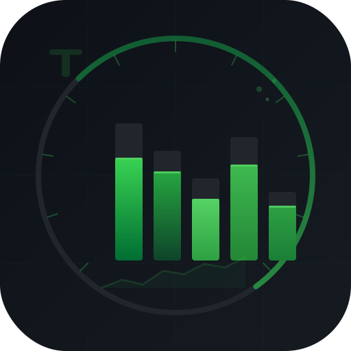
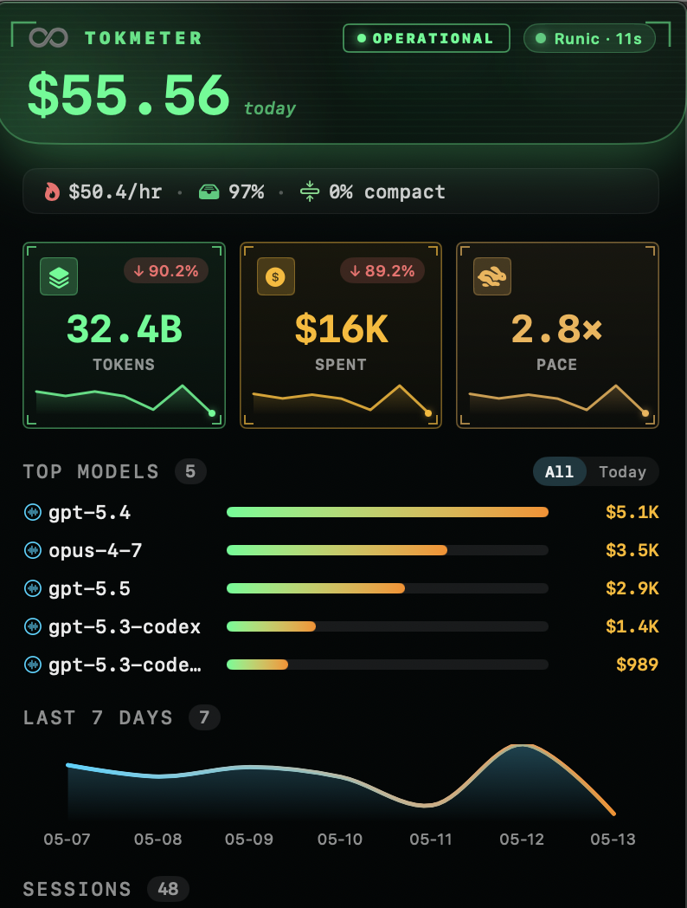
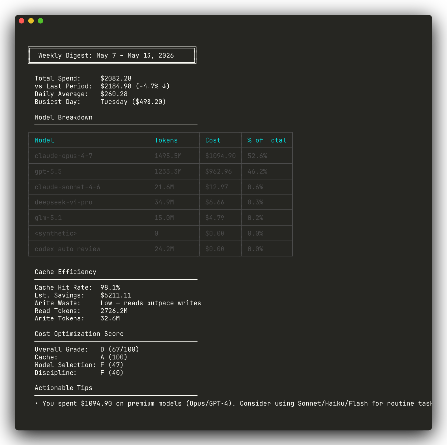
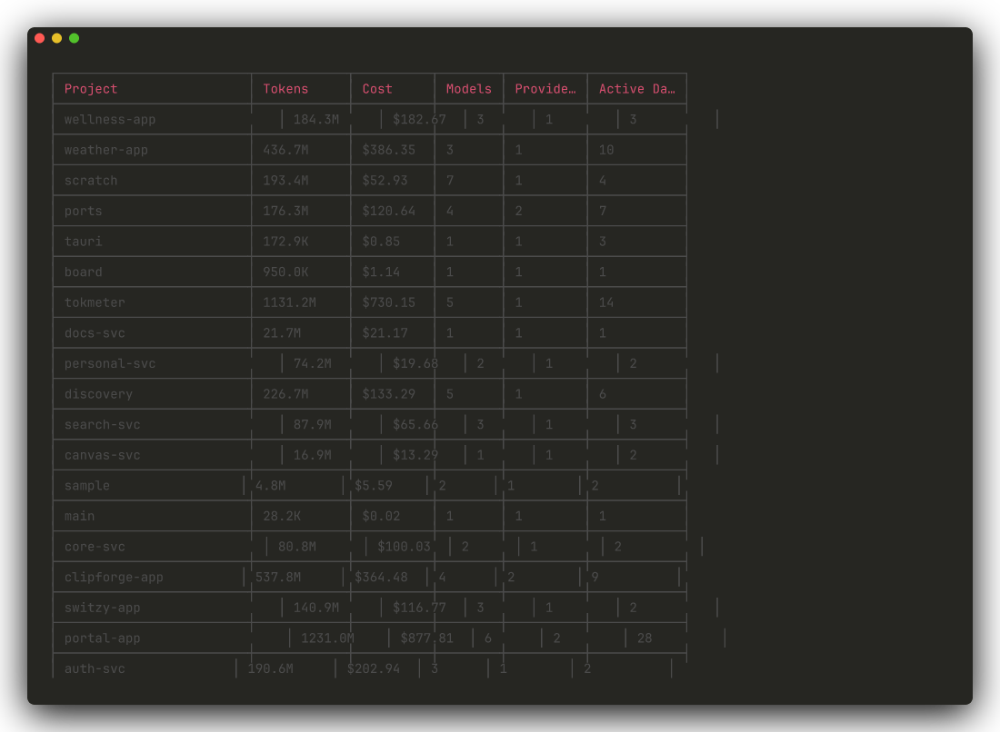

<p align="center">
  
</p>

<h1 align="center">tokmeter</h1>

<p align="center"><strong>Token Usage Tracker for AI Coding Agents</strong></p>

<p align="center">
  <a href="https://www.npmjs.com/package/@sriinnu/tokmeter"></a>
  
  
  
</p>

---

Tokmeter parses local session logs from 16+ AI coding agents into per-project / model / provider / day token-and-cost aggregates, and exposes them through five surfaces: CLI, TUI, web dashboard, MCP server, and a macOS menu-bar daemon.

Pricing is resolved locally via [`@sriinnu/kosha-discovery`](https://www.npmjs.com/package/@sriinnu/kosha-discovery) (20+ providers, 300+ OpenRouter models); nothing leaves the machine.

How it stores history, keeps "today" live, and stays memory-bounded - the daemon + relay model - is in [`docs/architecture.md`](docs/architecture.md). Package layout is under [Packages](#packages); programmatic use is under [Consume Tokmeter From Other Apps](#consume-tokmeter-from-other-apps).

## What it looks like

Below is exactly what tokmeter prints on a real machine - same code you'd `npm install`. Project names are swapped to generic ones for privacy; spend numbers, cache rates, optimization scores, model breakdowns, and everything else are unedited.

<table>
  <tr>
    <td align="center" width="50%">
      
      <br/><em>macOS menu bar - live signals at a glance.</em>
    </td>
    <td align="center" width="50%">
      
      <br/><em><code>tokmeter digest</code> - weekly cost report card with optimization grade.</em>
    </td>
  </tr>
</table>

<p align="center">
  
  <br/><em><code>tokmeter</code> - per-project breakdown across all parsed agents.</em>
</p>

Try it on your own data: `npx @sriinnu/tokmeter` (add `--light` to skip pricing on the first scan). More surface shots (TUI, web, Hub, statusline) are tracked in [`docs/assets/screenshots/README.md`](docs/assets/screenshots/README.md).

## What it computes

From parsed session logs, per project / model / provider / day:

- Cost and token totals (input / output / cache-read / cache-write / reasoning).
- Cache hit rate and cache savings.
- Daily spend trend and active-day streaks.
- Compaction overhead - the share of today's spend that went to `/compact`.
- Live burn rate and pace vs. your typical spend at this hour (from the relay's `costByHour`).
- Cheaper-model suggestions from the live kosha price registry.

All local; no network calls except the kosha pricing fetch.

## Quick Start

```bash
# Run directly
npx @sriinnu/tokmeter

# Or install globally - gives you both `tokmeter` and `tokmeter-tui`
npm install -g @sriinnu/tokmeter
tokmeter
tokmeter-tui
```

## Packages

Two packages ship to npm; everything else is bundled inside `@sriinnu/tokmeter`.

| Package | What | Install |
|---------|------|---------|
| [`@sriinnu/tokmeter`](packages/tokmeter/) | Umbrella distribution - bundles CLI + TUI + core + parsers | `npx @sriinnu/tokmeter` |
| [`@sriinnu/drishti`](packages/mcp/) | MCP server + live TUI + statusline + cross-provider daemon | `npx @sriinnu/drishti` |

The following packages are workspace-internal - they're built and bundled into
the umbrella above, not published as standalone npm packages:

- `@sriinnu/tokmeter-core` - session parsers, aggregator, pricing, public API
- `@sriinnu/tokmeter-cli` - CLI entry point (table + JSON output + cost digest)
- `@sriinnu/tokmeter-tui` - interactive terminal UI with charts
- `@sriinnu/tokmeter-web` - React + Plotly web dashboard with live mode (run locally; see [Web App](#web-app))

## Consume Tokmeter From Other Apps

Use the surface that matches the job:

| Need | Use | Notes |
| --- | --- | --- |
| Shell / CI automation | `npx @sriinnu/tokmeter --json` | Stable machine-readable contract for scripts |
| Convenience helpers without shelling out | `@sriinnu/tokmeter` imports | Exposes summary/project/model/stats helpers plus digest/cleanup/restore entrypoints |
| Live in-session token/cost answers | `@sriinnu/drishti` | MCP + daemon + statusline + live tracker |

### Programmatic convenience helpers

```ts
import {
  loadTokmeterSummary,
  loadTokmeterProjects,
  loadTokmeterModels,
  loadTokmeterStats,
  lookupTokmeterPricing,
} from "@sriinnu/tokmeter";

const summary = await loadTokmeterSummary({ month: true });
const projects = await loadTokmeterProjects({ project: "tokmeter" });
const models = await loadTokmeterModels({ providers: ["codex"] });
const stats = await loadTokmeterStats({ week: true, light: true });
const pricing = await lookupTokmeterPricing("claude-sonnet-4-20250514");
```

### Stable shell contract

```bash
npx @sriinnu/tokmeter --json
npx @sriinnu/tokmeter models --json --project tokmeter
npx @sriinnu/tokmeter digest --json --period week
```

For a deeper integration guide, see [`docs/consuming-tokmeter.md`](docs/consuming-tokmeter.md).

## CLI Usage

```bash
tokmeter                          # overview (all projects)
tokmeter models                   # per-model cost breakdown
tokmeter daily                    # daily usage over time
tokmeter projects                 # per-project summary
tokmeter stats                    # overall statistics
tokmeter pricing sonnet           # lookup model pricing
tokmeter digest                   # weekly cost digest with optimization score
tokmeter digest --period today    # today's digest
tokmeter digest --period month    # monthly digest

# Live & Daemon
tokmeter live                     # TUI dashboard
tokmeter statusline               # Statusline mode
tokmeter daemon start             # Start aggregation daemon
tokmeter daemon stop              # Stop daemon
tokmeter daemon status            # Check daemon status

# Pricing maintenance
tokmeter update                   # Refresh kosha pricing on demand
tokmeter pricing-audit            # Audit pricing coverage across observed models
tokmeter install-cron             # Install daily kosha-refresh cron (macOS launchd)
tokmeter uninstall-cron           # Remove the daily kosha-refresh cron
tokmeter cron-status              # Show daily-cron install + last-run state

# Backup / Restore (see docs/backup-restore.md)
tokmeter cleanup                  # interactive: pick projects → dates → confirm
tokmeter snapshot                 # non-destructive portable backup
tokmeter restore --latest         # restore the most recent backup

# Installer (all editors)
tokmeter install-statusline       # Install statusline for ALL editors
tokmeter install-mcp              # Install MCP for ALL editors
tokmeter editors                  # List supported editors

# Filters
tokmeter --project my-app         # specific project
tokmeter --claude --opencode      # specific providers
tokmeter --today                  # today only
tokmeter --week                   # last 7 days
tokmeter --month                  # current month
tokmeter --since 2025-01-01 --until 2025-12-31

# Output
tokmeter --json                   # JSON output (for piping/CI)
tokmeter --light                  # skip pricing (faster)
```

### Backup, Snapshot & Restore

`tokmeter cleanup`, `tokmeter snapshot`, and `tokmeter restore` handle disk
reclaim and cross-machine portability with automatic tar backups and
homedir-aware path remapping. See [docs/backup-restore.md](docs/backup-restore.md)
for the full walkthrough.

### Project Aliases

Collapse variants of the same project (e.g. `Vortex` on Mac and `vortex` on
Linux become one row), rename noisy canonical names
(`weather-app/frontend` → `weather-app`), tag projects (`work`,
`client`, `self`), or hide archived ones.

File: `~/.tokmeter/aliases.json`. Included in `snapshot` bundles automatically,
so your project renames and tags travel across machines with the rest of your
data.

```bash
tokmeter alias list                              # show current aliases
tokmeter alias set "Vortex" "Vortex"               # single rename
tokmeter alias merge "Vortex" "Vortex" "vortex"     # group keys under one display
tokmeter alias tag add "weather-app" work client
tokmeter alias hide "old-scratch"                # drop from per-project tables
tokmeter alias suggest                           # interactive auto-detect
```

Every entry carries `modifiedBy: "user" | "tokmeter"`. Auto-suggest only
proposes for unaliased keys; it **never overwrites** a user-flagged entry. User
confirmations flip the flag so future scans leave it alone.

### Cost Digest

The `digest` command gives you a cost report card:

```
+==========================================+
|  Weekly Digest: Mar 30 - Apr 5, 2026     |
+==========================================+

  Total Spend:     $2,847.32
  vs Last Week:    $2,102.55 (+35.4%)
  Daily Average:   $406.76
  Busiest Day:     Thursday ($892.11)

  Cache Efficiency: 98.2% hit rate
  Est. Savings:     $977.52

  Optimization Score: B (85/100)
    Cache:           A (100)
    Model Selection: A (100)
    Discipline:      F (40)

  Tips:
  - You spent $620 on GPT-5.4 today - Sonnet would've cost $124
  - Cache efficiency is solid at 98% - keep sessions active
```

Aliases: `tokmeter weekly`, `tokmeter report`

### Example Output

```
+---------------------------+------------+--------+--------+----------+---------+
| Project                   | Tokens     | Cost   | Models | Providers| Days    |
+---------------------------+------------+--------+--------+----------+---------+
| myapp                     | 2.4M       | $24.20 | 3      | 2        | 14      |
| api-server                | 800.0K     | $8.50  | 2      | 1        | 7       |
| scripts                   | 120.5K     | $1.44  | 1      | 1        | 3       |
+---------------------------+------------+--------+--------+----------+---------+

Total: 3.3M tokens | $34.14 | 24 active days
```

## Drishti -- MCP Server + Live Observatory + Daemon

[`@sriinnu/drishti`](packages/mcp/) is the observability layer. It provides:

### MCP Server

Exposes **24 tools** to Claude Code, Codex, Cursor, and any MCP client. All
tools are prefixed `drishti_*` so they don't collide with other servers in the
same client.

```json
// ~/.claude/settings.json
{
  "mcpServers": {
    "drishti": {
      "command": "npx",
      "args": ["-y", "@sriinnu/drishti", "mcp"]
    }
  }
}
```

**Snapshot & breakdowns:** `drishti_pulse`, `drishti_models`, `drishti_providers`, `drishti_projects`, `drishti_timeline`, `drishti_heatmap`

**Search, compare, export:** `drishti_search`, `drishti_compare`, `drishti_export`

**Cost intelligence:** `drishti_cache_efficiency`, `drishti_model_advisor`, `drishti_budget_alert`, `drishti_cost_optimization_tips`, `drishti_efficiency`, `drishti_anomaly`, `drishti_forecast`, `drishti_budget`

**Reports & behavior:** `drishti_digest`, `drishti_streaks`, `drishti_leaderboard`

**Storage hygiene:** `drishti_cleanup_preview`, `drishti_cleanup_execute`, `drishti_backups`, `drishti_restore`

Every tool output carries a transparency footer (record count, scan duration,
warnings for models with missing pricing) so you can audit the math.

### Statusline Hook

Live animated status bar inside Claude Code with cache hit rate:

```json
// ~/.claude/settings.json
{
  "statusLine": {
    "type": "command",
    "command": "npx -y @sriinnu/drishti statusline"
  }
}
```

```
【♾️】 ○ ❯ 📂myproject ❯ 🌿main ❯ ⚡$5.97 ❯ sonnet-4 ❯ ↑42.5K ↓18.2K ❯ ⚡98.2% ❯ 🔥$4.55/hr ❯ 📈 today $37.8
```

Features:
- Rainbow animated infinity logo
- Real-time token counts with intensity bars
- Live cost tracking with hourly burn rate
- Cache hit rate indicator (green >80%, yellow 50-80%, red <50%)
- Today's total across all providers
- Cross-provider aggregation when daemon is running
- Bulletproof -- 4 concentric safety layers guarantee output even if dependencies fail

### Cross-Provider Aggregation Daemon

The daemon aggregates token usage across **multiple AI coding assistants running simultaneously**:

```bash
# Start the daemon
tokmeter daemon start

# Check status
tokmeter daemon status

# Stop the daemon
tokmeter daemon stop
```

When multiple Claude Code, Codex, or OpenCode instances are running, the statusline shows **aggregated totals** across all of them in real-time via WebSocket.

The daemon is the **single source of truth**: it holds usage warm in memory and
every consumer (macOS bar, statusline, MCP) is a thin **reader** of it. Opening
the macOS bar starts the daemon if it's down (singleton - only one ever runs),
and nothing else scans the corpus on a hot path. This keeps reads fast and
memory bounded. See [docs/architecture.md](docs/architecture.md) for the data
freshness, immutability, and memory model.

### Live TUI

```bash
npx @sriinnu/drishti live
# or
tokmeter live
```

Real-time terminal dashboard with 2-second refresh.

## Universal Installer

Install statusline and MCP across **all supported editors** at once:

```bash
# Install statusline for Claude Code, OpenCode, Codex
tokmeter install-statusline

# Install MCP server for all editors
tokmeter install-mcp

# List supported editors
tokmeter editors
```

Supported editors:
- **Claude Code** -- statusline + MCP
- **OpenCode** -- statusline + MCP
- **Codex** -- statusline + MCP
- **Cursor** -- MCP
- **Windsurf** -- MCP
- **Zed** -- MCP

## TUI

Interactive terminal UI with bar charts, sparklines, and contribution heatmaps.

```bash
# After `npm install -g @sriinnu/tokmeter`
tokmeter-tui

# Or one-shot
npx -p @sriinnu/tokmeter tokmeter-tui
```

| View | Key | Description |
|------|-----|-------------|
| Overview | `1` | Bar charts, sparklines, provider breakdown |
| Models | `2` | Sortable table with inline charts |
| Daily | `3` | Sparkline + heatmap |
| Stats | `4` | Streaks, averages, contribution calendar |

## Web App

React + Plotly dashboard with rich visualizations and **live mode**.

```bash
cd packages/web
bun install
bun run dev
```

Open http://localhost:3000

When the daemon is running, the web dashboard connects via WebSocket and shows **live session data** alongside historical charts:
- Green pulsing "Live" indicator when connected
- Real-time cost, token counts, and active sessions
- Per-provider and per-model live breakdowns
- Falls back to static data when daemon is offline

| Chart | Description |
|-------|-------------|
| Model cost bars | Horizontal bar chart comparing model costs |
| Provider pie | Donut chart of cost split by provider |
| Daily trend | Dual-axis line chart (tokens + cost) |
| Token breakdown | Stacked bars (input/output/cache per model) |
| Contribution heatmap | GitHub-style calendar heatmap |

Export data: `tokmeter --json > packages/web/public/data.json`

## macOS Menu Bar

A native SwiftUI menubar app that surfaces your live token spend without ever
leaving the menubar. Reads from the daemon when it's running, falls back to
the CLI on disk when it isn't.

The menu bar icon itself is a live health gauge: it tints **green → yellow → red**
as your most-loaded session approaches its ceiling (worst-session-wins across every
connected provider). Pick which ceiling drives the color in settings - **context
window** fill, the Claude **5-hour block**, or a **daily budget** - so the signal
works whether or not a provider reports a context window. Turn it off for a plain
monochrome icon.

<p align="center">
  
</p>

```bash
bun run bar                        # build, install to /Applications, launch
```

Beyond the standard totals (today's cost, week sparkline, top models, per-project
sessions), the bar surfaces a set of live "right now" signals so the surface reads
as a speedometer, not a scoreboard. The statbar foregrounds these six; the rest
(subagent share, reasoning share, per-tool cost, Claude 5-hour billing window,
per-project context pressure) live in the Hub. All eleven are computed in one pass
in [`packages/core/src/signals.ts`](packages/core/src/signals.ts):

| Signal | What it tells you |
|--------|-------------------|
| **Burn rate** | $/hr over the last 60 min - color ramps green → amber → red as you heat up. |
| **Cache hit %** today | Read tokens served from cache. Two denominators are tracked: the *canonical* rate `cacheRead / (input + cacheRead + cacheWrite)` (counts cache writes as a cost, the honest number) and a *legacy read-share* `cacheRead / (input + cacheRead)` for back-compat. The bar shows the read-share; `missRate + cacheWriteShare + canonicalRate` always sums to exactly 1. |
| **Pace** | Today's cost-by-this-hour vs. the median of your last 7 active days. Tortoise / hare / equal icon. |
| **Compaction tax** | % of today's spend going to `/compact` overhead (Claude Code-specific signal). |
| **Context pressure** | How much the latest request's input has grown over the session's early baseline (the "drag" cache reads add) - the lever behind when to `/compact`. |
| **Live session pill** | The project + age of the most recent record when something's run in the last 5 min. |

Seven themes (Terminal / Paper / Nebula / Aurora / Noise / Nocturne / Glass) and
a companion "Hub" full-window with project drilldown, command palette, and
settings. Aurora uses a slow-drifting gradient - motion as identity. Noise is
neobrutalist (canary yellow + sticky-note cards with hard offset shadows).

## Supported Providers

| Provider | Data Location |
|----------|--------------|
| Claude Code | `~/.claude/projects/**/*.jsonl` |
| OpenCode | `~/.local/share/opencode/opencode.db` (SQLite) + legacy JSON |
| Codex CLI | `~/.codex/sessions/*.jsonl` |
| Gemini CLI | `~/.gemini/tmp/*/chats/*.json` |
| Cursor IDE | `~/.config/tokscale/cursor-cache/` (API sync) |
| Amp | `~/.local/share/amp/threads/` |
| Droid | `~/.factory/sessions/` |
| OpenClaw | `~/.openclaw/agents/` + legacy paths |
| Pi | `~/.pi/agent/sessions/` |
| Kimi CLI | `~/.kimi/sessions/` |
| Qwen CLI | `~/.qwen/projects/` |
| Roo Code | VS Code globalStorage |
| Kilo | VS Code globalStorage |
| Kilo CLI | `~/.local/share/kilo/kilo.db` (SQLite) |
| Mux | `~/.mux/sessions/` |
| Synthetic | Re-attributed from other sources |

OpenRouter models (free and paid) are automatically detected via model ID format and priced through kosha-discovery's OpenRouter integration.

## Pricing

Pricing is resolved entirely through [`@sriinnu/kosha-discovery`](https://github.com/sriinnu/kosha-discovery)
 - one source of truth, refreshed daily, no stale hardcoded fallback.

Resolution chain (see `packages/core/src/pricing.ts`):

1. **In-memory cache** - per-process, invalidated on kosha registry mtime change.
2. **User overrides** - `~/.tokmeter/pricing-overrides.json` for negotiated rates, free internal deployments, or per-model corrections. Keyed by exact model id; partial `ModelPricing` shapes accepted.
3. **kosha direct** - `registry.model(id)` for canonical model IDs. Prefers `originPricing` (direct-provider rate) over `pricing` (proxy/gateway rate) when both are usable.
4. **kosha fuzzy** - searches the full discovered catalog with an exact-first scorer; covers the long tail (including 300+ OpenRouter models).
5. **Manifest fallback** - direct read of `~/.kosha/registry.json` when the runtime state is missing models the manifest knows about.

Reasoning tokens get their own rate when kosha publishes one (o1/o3/gemini-thinking/deepseek-r1 and equivalents); otherwise they fall back to the output rate with the cell flagged.

Covers Anthropic, OpenAI, Google, DeepSeek, xAI, Mistral, Meta, Moonshot, Cohere, Perplexity, Qwen, and 10+ more - whatever kosha is currently tracking.

Historical records are immutable: prices freeze at write time. Only today reprices when kosha updates. The `tokmeter routes` CLI extends this into a cost-surface explorer - projects today's exact token shape against every model in your lifetime lineup using kosha's live registry, with Δ-vs-actual and honest exclusion of unpriced models. Run `tokmeter routes` for a table or `tokmeter routes --json` for piping. Layer 1 (pure pricing translation) ships in v1.3.0; the full multi-layer design is in [`docs/designs/routes.md`](docs/designs/routes.md).

All formatters are NaN/Infinity-safe - malformed data never leaks into output.

## Performance

The daemon scans your sessions once, persists them as per-day immutable aggregate files, and serves every reader (CLI, statusline, bar, web) from in-memory state.

**Storage layout** (`~/.cache/tokmeter/aggregates/`):

| | before (v2 monolith) | after (v3 relay) | delta |
|---|---|---|---|
| History store on disk | 1 file × 187 MB | 152 files × ~6 KB each (~892 KB total) | **220× smaller** |
| Lifetime `TokenRecord[]` in heap | held warm | structurally eliminated | gone |
| Cold-start I/O | parse 187 MB JSON + dispatch | load ~892 KB + bounded 14-day mtime-pruned scan | bounded by gap, not corpus |

**Hot-path query latency** (measured against a 77 GB / 319k-record corpus, daemon HTTP port):

| endpoint | cache hit (within 12s TTL) | cache miss (TTL refresh) | response size |
|---|---|---|---|
| `/api/stats` | ~1–6 ms | ~5 s (today scan) | 341 B |
| `/api/today` | ~1 ms | - | ~700 B |
| `/api/projects` | ~2–4 ms | - | 170 KB |
| `/api/models` | ~1 ms | - | 7.5 KB |
| `/api/daily` | ~1 ms | - | 30 KB |
| `/api/statbar-signals` | ~38–58 ms | - | 4.6 KB |
| `/api/cross-tool` | ~2 ms | - | 600 B |

The statusline polls inside the 12 s TTL, so every visible query is a cache hit. One query per TTL window pays the today-scan cost; that scan is mtime-pruned, so it only touches files modified today (typically a handful of active session files).

**Memory - the honest version:** RSS is noisy on macOS (V8 retains arenas after GC) and the parser-level scan cache (`~/.cache/tokmeter/scan-cache.json`, ~34 MB on disk, several× that in heap) is real weight, so any single `ps` sample is meaningless. Sampled over a warm session the daemon sits in a **~700 MB – 1.1 GB steady-state band**, dips briefly toward ~30 MB right after a GC, and spikes toward ~1.5 GB mid-scan. That is *modestly* better than the pre-v1.5 daemon's stable ~1 GB+ - not the dramatic reduction the early numbers suggested. The win that actually holds is **structural, not the RSS figure**: the daemon no longer pins lifetime records in heap (bounded 14-day window instead), and the on-disk store is 220× smaller. The remaining heap bulk is the scan cache; bounding it to the same 14-day watermark is the next memory fight.

**Reproduce locally:**

```bash
# Stop daemon, restart, sample RSS over warmup
node packages/cli/dist/cli.js daemon stop
node packages/cli/dist/cli.js daemon start
PID=$(cat ~/.tokmeter/daemon/daemon.pid)
for i in 1 2 3 4 5; do ps -o rss,pcpu -p $PID | tail -1; sleep 2; done

# Endpoint latency battery
TOK=$(cat ~/.tokmeter/daemon/daemon.token)
for ep in api/stats api/today api/projects api/models api/daily; do
  curl -s -H "Authorization: Bearer $TOK" -o /dev/null \
    -w "$ep  %{time_total}s  %{size_download}B\n" \
    http://127.0.0.1:9877/$ep
done

# Relay store inspection
ls -1 ~/.cache/tokmeter/aggregates/ | wc -l   # day count
du -sh ~/.cache/tokmeter/aggregates/          # total size
```

## Architecture

```
Session Files (local disk)
    |
@sriinnu/tokmeter-core (parsers -> aggregation -> pricing via @sriinnu/kosha-discovery)
    |
    +-- per-day relay store (~/.cache/tokmeter/aggregates/YYYY-MM-DD.json, immutable)
    +-- rolling 14-day record window (signals lookback)
    +-- live today accumulator (DailyAccumulator, sealed at midnight)
    +-- StatbarSignals (burn/cache/pace/compaction/live)
    |
+----------+----------+----------+----------+-----------+----------+
|  CLI     |  TUI     |  Web App | Drishti  | Daemon    | macOS    |
| (table)  | (Ink)    | (Plotly) | (MCP)    | (WebSocket)| menu bar |
| (digest) |          | (live)   | (24 tools)|           | (Swift)  |
+----------+----------+----------+----------+-----------+----------+
```

### Relay store (history persistence)

History is a relay race of **per-day immutable aggregate files** at
`~/.cache/tokmeter/aggregates/YYYY-MM-DD.json` (~6 KB each). Each sealed day is
write-once-ever - no code path rewrites an existing day file. "Today" lives only
in an in-memory `DailyAccumulator`; at the midnight rollover (or the first scan
after it) the accumulator seals to its own day file and a fresh one starts. The
raw session JSONL is just the *source* today is re-derived from - once a day is
sealed, **deleting the underlying JSONL loses nothing**, because the sealed
aggregate already holds that day's counts. Cross-machine sync is plain `rsync`:
each day file is a self-contained unit, so union-merging two machines'
`aggregates/` directories yields unified history with no coordination protocol.

### Daemon lifecycle (and why the bar reads `/tmp`)

The daemon binds two localhost ports - `9876` (WebSocket, live registration) and
`9877` (HTTP REST, every reader's query path). On a successful bind it writes its
PID and an auth token to **two** locations:

- **Canonical** - `~/.tokmeter/daemon/daemon.{pid,token}` (the source of truth;
  the daemon's own singleton guard reads this).
- **Legacy shim** - `/tmp/drishti-daemon.{pid,token}` (what the macOS bar reads).

The bar treats "is the daemon up?" as `fileExists(/tmp/drishti-daemon.pid)` +
`kill(pid, 0)` + a `proc_name` check, *before* it ever hits HTTP - this avoids a
60 s URLSession hang when the daemon is genuinely down. The catch: macOS reaps
`/tmp` files untouched for ~3 days. A daemon that stays up for days writes the
shim once at startup and never again, so the reaper eventually deletes it - after
which the bar reports **"offline" against a perfectly healthy daemon**, and a
naive restart can't recover (the live daemon still owns the *canonical* pidfile,
so the singleton guard makes the new start bow out). The fix: the daemon
re-asserts the `/tmp` shims on its 10 s state-save tick whenever they go missing,
so the reaper can never outlast it (`reassertLegacyShims` in
`packages/mcp/src/daemon/server.ts`).

## Development

```bash
git clone https://github.com/sriinnu/tokmeter.git
cd tokmeter
bun install
bun run build

# Run surfaces
bun run cli                    # CLI overview
bun run cli:models             # Model breakdown
bun run cli:daily              # Daily usage
bun run cli:projects           # Project breakdown
bun run cli:stats              # Statistics
bun run cli:digest             # Cost digest report
bun run cli:pricing            # Model pricing lookup
bun run tui                    # Interactive TUI
bun run dev:web                # Web dashboard (dev server)
bun run drishti:live           # Live TUI dashboard
bun run drishti:serve          # MCP server
bun run drishti:statusline     # Statusline hook

# Daemon
bun run daemon:start           # Start aggregation daemon
bun run daemon:stop            # Stop daemon
bun run daemon:status          # Check daemon status

# Installer
bun run install:statusline     # Install statusline for all editors
bun run install:mcp            # Install MCP for all editors
bun run list:editors           # List supported editors

# macOS menu bar (Swift app)
bun run bar                    # Build + install to /Applications + launch (ad-hoc signed)
bun run bar:build              # Build only - produces ./packages/macos-bar/TokmeterBar.app
bun run bar:signed             # Developer ID signed - Gatekeeper-friendly for AirDrop
bun run bar:release            # Signed + notarized + stapled + appcast.xml updated
                               # Requires packages/macos-bar/.env with Apple credentials.
                               # See packages/macos-bar/RELEASE.md for the full pipeline.
bun run bar:publish            # Upload the built TokmeterBar-<version>.zip to a
                               # GitHub release v<version>. Run after bar:release.
bun run bar:ship               # One-shot: clean → bar:release → bar:publish.
                               # Bump CFBundleShortVersionString in bundle.sh first.

# Cleanup
bun run clean                  # Remove dist/, *.tsbuildinfo, .build/, *.app, *.zip, *.dSYM,
                               # plus any leaked tsc emit (.js/.d.ts) inside src/ dirs

# Quality
bun run test                   # Run tests (230 passing + 11 todo across the monorepo)
bun run lint                   # Lint
bun run format                 # Format
```

## License

- Application - AGPL-3.0-only: [LICENSE](./LICENSE)
- Core library `@sriinnu/tokmeter-core` - MPL-2.0: [packages/core/LICENSE](./packages/core/LICENSE)

Copyright (c) 2026 Srinivas Pendela.
