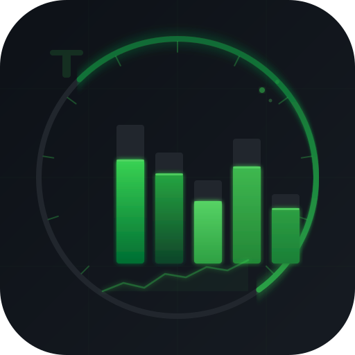
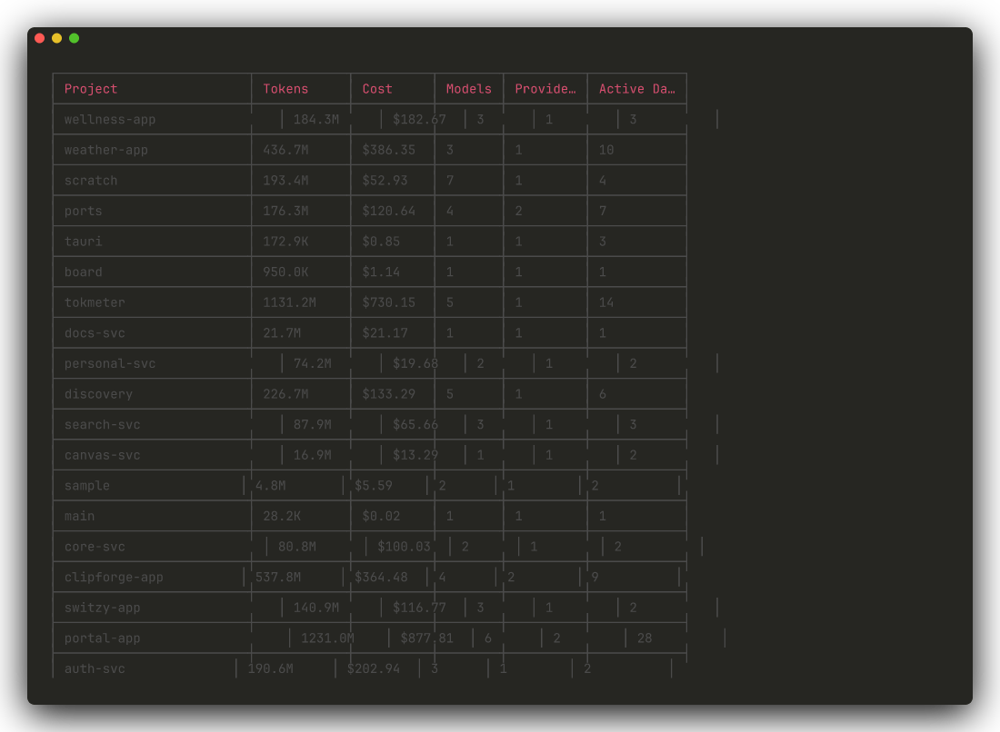
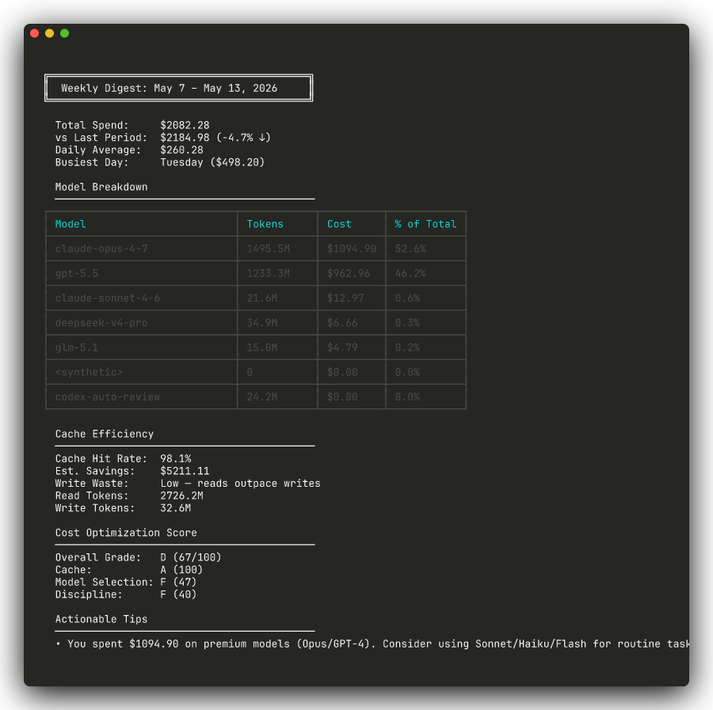
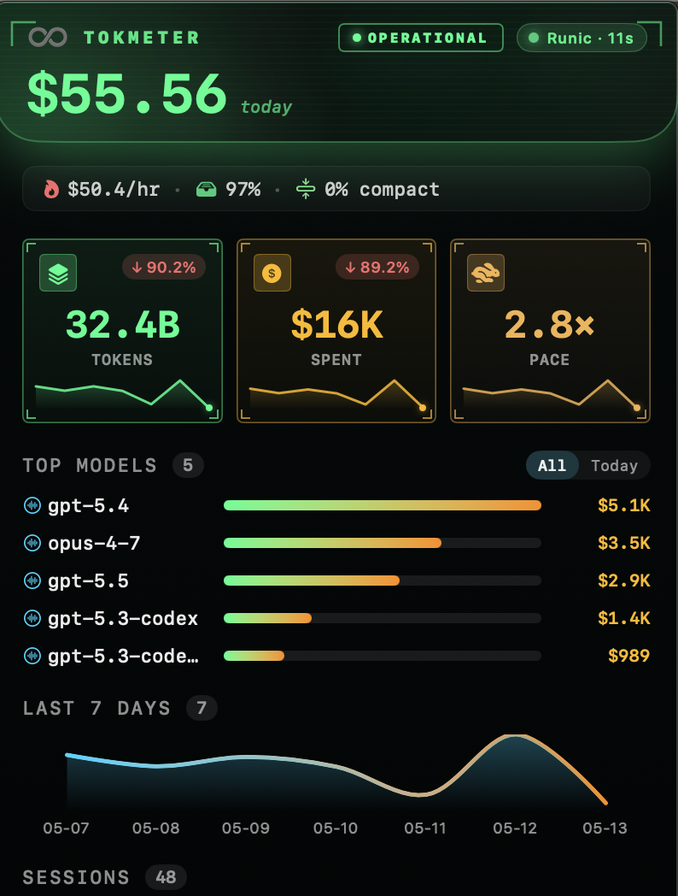

<div align="center">



# Tokmeter

**Every AI coding agent you run, on one ledger.**

Tokmeter reads the session files your agents already write to disk and turns them into token and cost totals by project, model, provider, and day — across Claude Code, Codex, Gemini CLI, Cursor, and a dozen more. No API keys, no telemetry, no account. Your data never leaves the machine.

[](https://github.com/sriinnu/tokmeter/releases)
[](https://www.npmjs.com/package/@sriinnu/tokmeter)
[](LICENSE)
[](packages/macos-bar/README.md)

</div>

---

## Why

Every agent bills you separately and shows you its own slice. Claude Code knows what Claude Code cost. Codex knows what Codex cost. Nothing knows what *today* cost, or which project is quietly burning the most, or whether the model you switched to is actually cheaper for the work you do.

Tokmeter answers that from data already on your disk. It parses each agent's local session logs, prices them against a live model catalog, and keeps an append-only daily ledger so history survives even after the agents rotate their own logs away.

```sh
npx @sriinnu/tokmeter --today
```

## What it looks like

| | |
|---|---|
|  |  |
| **CLI** — usage by project, model and provider | **Digest** — a weekly report card |

<div align="center">


**macOS menubar** — today's tokens and cost, always visible
</div>

There is also a terminal UI (`tokmeter-tui`), a local web dashboard, a statusline for Claude Code, and an MCP server so an agent can query its own spending.

## Install

Requires Node.js 18+. Reading session files needs no provider credentials; pricing lookups fetch a public catalog, and `--light` skips them entirely.

```sh
# Try it without installing
npx @sriinnu/tokmeter --today

# Install the CLI, and the daemon/MCP server
npm install -g @sriinnu/tokmeter @sriinnu/drishti
```

| Package | Contents |
| --- | --- |
| [`@sriinnu/tokmeter`](packages/tokmeter/README.md) | Core API, CLI, and terminal UI |
| [`@sriinnu/drishti`](packages/mcp/README.md) | MCP server, daemon, statusline, and live terminal UI |

`packages/core`, `packages/cli`, and `packages/tui` are private workspace packages bundled into `@sriinnu/tokmeter`. `packages/web` is a separate private workspace app run from source.

Claude Code and Codex are the primary validation targets. See [provider compatibility](docs/compatibility.md) for the other parsers and their known limits.

## CLI

```sh
tokmeter --today
tokmeter models --project my-app --json
tokmeter daily --week
tokmeter projects
tokmeter stats --month
tokmeter digest --period week
tokmeter pricing sonnet
```

Filters include `--project`, `--claude`, `--codex`, `--week`, `--month`, and `--since YYYY-MM-DD --until YYYY-MM-DD`. Use `--json` for machine-readable output and `--light` for token-only reports.

- [Aliases](docs/aliases.md): merge display names, tag projects, or hide them from lists.
- [Backup and restore](docs/backup-restore.md): portable snapshots, cleanup preview, restore. Cleanup deletes source files; keep the confirmation and backup steps.
- [CLI reference](packages/cli/README.md): every command with examples.
- [How the numbers work](docs/how-the-numbers-work.md): what each bucket means and where estimates enter.

## TypeScript API

The root export provides the core API. Convenience query helpers use the `/cli` subpath.

```ts
import { TokmeterCore } from "@sriinnu/tokmeter";
import { loadTokmeterSummary } from "@sriinnu/tokmeter/cli";

const core = new TokmeterCore();
await core.scan({ providers: ["codex", "claude-code"], today: true });
const models = core.getModelCosts();
const daily = core.getDailyBreakdown();

const summary = await loadTokmeterSummary({ week: true, light: true });
```

Reuse one core scan when querying several breakdowns. See [integration guidance](docs/consuming-tokmeter.md), [core API usage](packages/core/README.md), and [SKILL.md](SKILL.md) for agent-facing integration instructions.

## Daemon, MCP, and statusline

```sh
drishti daemon start
drishti daemon status
drishti serve             # MCP server over stdio
drishti statusline        # one statusline tick
drishti live              # live terminal UI
```

The daemon uses local HTTP port `9877` for queries and WebSocket port `9876` for live registration. The macOS app, statusline, and MCP server consume its shared state. Daemon commands belong to `@sriinnu/drishti`; install it for these surfaces.

MCP tools use the `drishti_` prefix and cover usage queries, comparisons, forecasts, export, and confirmed cleanup/restore operations. See the [Drishti reference](packages/mcp/README.md) for names, configuration, and programmatic exports.

`drishti editors` lists installer targets. `drishti install-mcp` and `drishti install-statusline` write editor configuration; inspect the generated settings for your editor. See [architecture](docs/architecture.md) for registration, authentication, refresh, storage, and daemon lifecycle details.

## Terminal and web interfaces

```sh
# After installing @sriinnu/tokmeter
tokmeter-tui

# Without a global install
npx -p @sriinnu/tokmeter tokmeter-tui
```

The terminal UI supports overview, model, daily, and statistics views. See its [keys and commands](packages/tui/README.md).

Run the web workspace from a source checkout:

```sh
bun install
bun run dev:web
```

Open `http://localhost:3000`. See [web setup and data sources](packages/web/README.md).

## macOS app

Release builds target Apple silicon and macOS 14+. Node.js 18+ with npx is also required for the local daemon.

Install `@sriinnu/drishti`, run `drishti daemon start`, then open TokmeterBar from `/Applications`. Download the app from [GitHub Releases](https://github.com/sriinnu/tokmeter/releases).

The popup gives today's tokens and estimated API cost equal prominence, with models and projects below. Chart hover cards show exact daily tokens and cost. **Usage details** expands lifetime totals, trends, and signals. Six themes are selectable: Terminal, Paper, Prism, Lagoon, Carbon, and Glass. The Hub provides larger breakdowns and settings. Settings → **Open web dashboard** starts its local server on demand; **Stop web dashboard** or quitting the app stops it.

See [macOS build and runtime details](packages/macos-bar/README.md), [first-use checks](docs/macos/first-use.md), and [popover validation](docs/macos/popover-usability.md). The [completion tracker](docs/macos-completion.md) records remaining fresh-machine, reliability, update, accounting, accessibility, and trial gates.

The [synthetic walkthrough](docs/assets/demo/README.md) documents how the example images were generated; it is not a capture of a current local candidate.

## License

[AGPL-3.0-only](LICENSE). See [licensing notes](docs/licensing.md) for what that means if you embed Tokmeter in another product.
