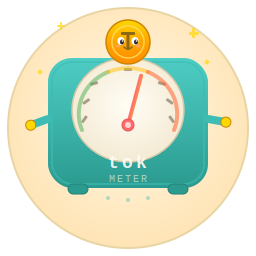

<p align="center"></p>

<h1 align="center">@sriinnu/tokmeter</h1>

<p align="center">
  Token usage tracking for AI coding agents — parsers, CLI, and TUI
</p>

<p align="center">
  <a href="https://www.npmjs.com/package/@sriinnu/tokmeter"></a>
  
  = 18" />
</p>

---

**@sriinnu/tokmeter** is the unified package for tracking token consumption across 16+ AI coding agents. It bundles the core parsing/aggregation engine, the CLI, and the interactive TUI into a single install with subpath exports.

Scans local session files from Claude Code, Cursor, Codex CLI, Gemini CLI, OpenCode, Amp, Roo Code, Kilo Code, and more. Breaks down usage by project, model, provider, and day. Computes real-time cost estimates powered by [`@sriinnu/kosha-discovery`](https://www.npmjs.com/package/@sriinnu/kosha-discovery).

## Install

```bash
npm install @sriinnu/tokmeter
```

Or run directly without installing:

```bash
npx @sriinnu/tokmeter
```

## Subpath Exports

| Import path                | What you get                           |
| -------------------------- | -------------------------------------- |
| `@sriinnu/tokmeter`       | Core engine — parsers, aggregation, pricing |
| `@sriinnu/tokmeter/cli`   | CLI entry point and helpers            |
| `@sriinnu/tokmeter/tui`   | Interactive terminal UI with charts    |

## Binaries

| Command         | Description                        |
| --------------- | ---------------------------------- |
| `tokmeter`      | CLI — tables, JSON, filters, digest |
| `tokmeter-tui`  | Interactive TUI dashboard           |

## Usage

### Core API

```typescript
import { TokmeterCore } from "@sriinnu/tokmeter";

const core = new TokmeterCore();

// Scan all session files
const records = await core.scan();

// Get per-project breakdown
const projects = core.getAllProjects();
// => [{ project: "my-app", totalTokens: 842000, totalCost: 1.23, ... }]

// Get per-model costs
const models = core.getModelCosts();

// Get daily usage trend
const daily = core.getDailyBreakdown();

// Get overall stats
const stats = core.getStats();
// => { totalTokens, totalCost, activeDays, longestStreak, ... }
```

#### Filtering

```typescript
// Today only
const today = await core.scan({ today: true });

// Last 7 days
const week = await core.scan({ week: true });

// Specific date range
const range = await core.scan({
  since: "2025-01-01",
  until: "2025-01-31",
});

// Single provider
const claude = await core.scan({
  providers: ["claude-code"],
});

// Single project
const project = await core.scan({
  project: "my-app",
});
```

#### Pricing

```typescript
import { PricingService } from "@sriinnu/tokmeter";

const pricing = new PricingService();
await pricing.init();

const info = await pricing.getPricing("claude-sonnet-4-20250514");
// => { inputPerMillion: 3.00, outputPerMillion: 15.00, cacheReadPerMillion: 0.30, ... }
```

### CLI

```bash
# Default overview — project table + totals
tokmeter

# Per-model breakdown
tokmeter models

# Daily usage over time
tokmeter daily

# Overall statistics
tokmeter stats

# Weekly cost digest with trends
tokmeter digest

# Filter by date
tokmeter --today
tokmeter --week
tokmeter --month
tokmeter --since 2025-01-01 --until 2025-03-31

# Filter by provider
tokmeter --claude
tokmeter --cursor
tokmeter --codex

# Filter by project
tokmeter models --project my-app

# JSON output (pipe to jq, scripts, etc.)
tokmeter --json
tokmeter models --json

# Pricing lookup
tokmeter pricing claude-sonnet-4-20250514

# Cleanup old session data
tokmeter cleanup --project old-app --backup
tokmeter restore --latest
```

### TUI

```bash
# Launch the interactive terminal dashboard
tokmeter-tui
```

The TUI provides a real-time interactive view with navigable project/model/daily panels and inline charts.

## Supported Providers

Claude Code, OpenCode, Codex CLI, Gemini CLI, Cursor, Amp, Droid, OpenClaw, Pi, Kimi, Qwen, Roo Code, Kilo Code, Kilo CLI, Mux, Windsurf, and more.

## Author

**Srinivas Pendela** — [@sriinnu](https://github.com/sriinnu)

## License

[MIT](https://opensource.org/licenses/MIT)
